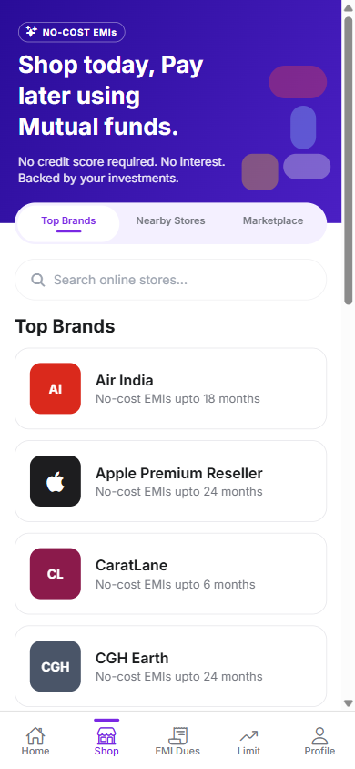
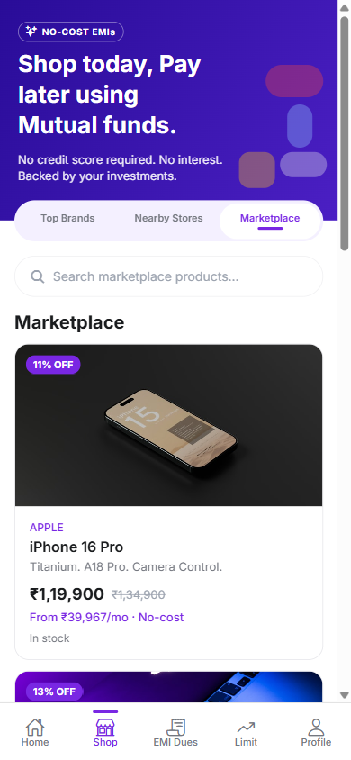
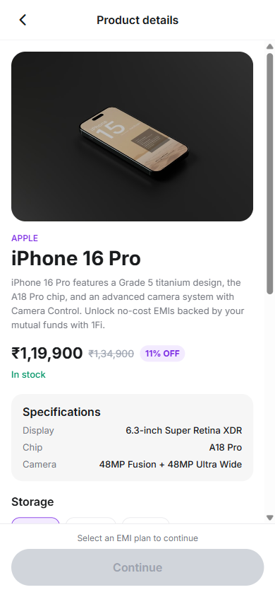
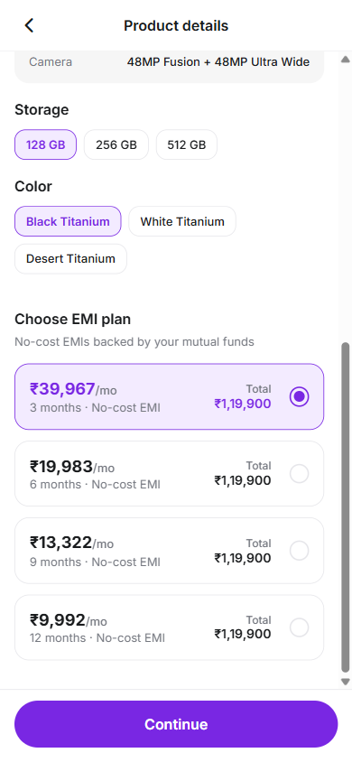
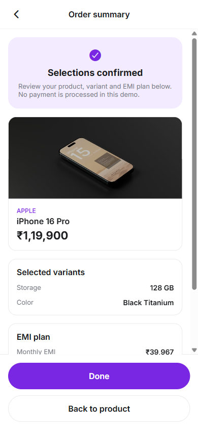
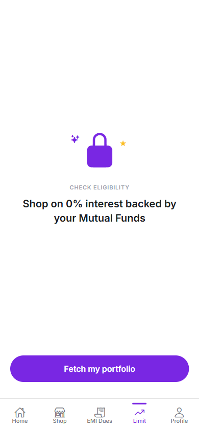
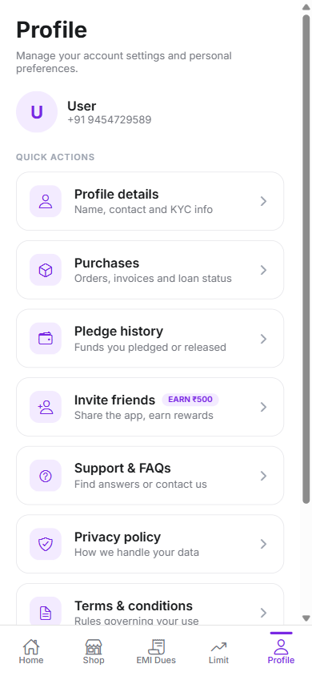

# 1Fi Marketplace

Expo (React Native + TypeScript) app that extends the 1Fi Shop experience with a Marketplace flow for the SDE Intern assignment.

## Features

- App shell aligned with 1Fi screenshots: Home, Shop, EMI Dues, Limit, Profile
- Shop hero banner, segment control, search, and Top Brands list
- Nearby Stores placeholder (blank, as allowed)
- Marketplace: product listing, details, variants, EMI selection, Continue, confirmation
- Loading, error with Retry, empty, and product-not-found states
- Typed mock API layer (UI does not hardcode product data)

## Tech Stack

- Expo SDK 57 and Expo Router
- React Native and TypeScript
- Inter via Expo Google Fonts
- expo-image, expo-linear-gradient, @expo/vector-icons

## Architecture

```
app/                    Expo Router screens (tabs, product, confirmation)
src/
  components/           Reusable UI
  data/                 Mock brands and products
  services/             brandService and productService
  theme/                Colors, spacing, typography
  types/                Brand, Product, Variant, EmiPlan
  utils/                INR formatting and EMI helpers
```

Screens call services. Services read mock data and simulate async latency.

## Running Locally

```bash
npm install
npm start
```

Press `a` for Android, `i` for iOS, `w` for web, or scan the QR code with Expo Go.

## Screenshots

Mobile viewport captures from the running app (`docs/screenshots/`):

| Screen | Preview |
|--------|---------|
| Shop - Top Brands |  |
| Marketplace listing |  |
| Product details |  |
| EMI selected |  |
| Confirmation |  |
| Limit |  |
| Profile |  |

## Deploy (free options)

Live demos:

- **Vercel (production):** https://1fi-marketplace-alpha.vercel.app
- **GitHub Pages:** https://theanushkaraghuvanshi.github.io/1fi-marketplace/ (deploys from Actions on every push to `main`)

Other free options:

1. **Expo Go:** run `npm start` and open with Expo Go on a phone.
2. **EAS Build:** free tier for development Android/iOS builds.

No paid backend is required. Marketplace data is mock data in the repo.

Redeploy web locally:

```bash
npx expo export --platform web
npx vercel --prod
```

## Marketplace Flow

1. Open Shop
2. Select Marketplace
3. Open a product
4. Choose storage, color, or model variants
5. Select one EMI plan (Continue stays disabled until then)
6. Tap Continue to see the confirmation summary

## Mock API

- `src/data/products.ts` and `src/data/brands.ts`: mock catalogs
- `productService.getProducts()` and `getProductById(id)`
- `brandService.getBrands({ search })`
- EMI plans are no-cost (principal divided by months). No invented interest rates.

## Assumptions

1. Built as a new Expo app because no official 1Fi codebase was provided.
2. Shop adds a third segment, Marketplace (live screenshots only show Top Brands and Nearby Stores).
3. Top Brands and Nearby Stores do not need deep functionality.
4. No real payments, KYC, or loan APIs. Confirmation ends the demo flow.
5. Marketplace product layout follows 1Fi design tokens. Exact product screenshots were not provided, so catalog content is mock data.
6. Brand logos use colored initials (Apple uses the Apple icon).

## Scripts

```bash
npm run typecheck
npm run lint
npm test
npm run export:web
```

## Assignment Checklist

- [x] Shop exposes Top Brands, Nearby Stores, Marketplace
- [x] Marketplace listing and product details
- [x] Variants and EMI selection with clear selected state
- [x] Continue gated until EMI is selected
- [x] Confirmation preserves selections
- [x] Service layer (not hardcoded UI data)
- [x] Loading, error, empty, and not-found states
- [x] UI consistent with provided 1Fi shell screenshots
- [x] README and runnable project
